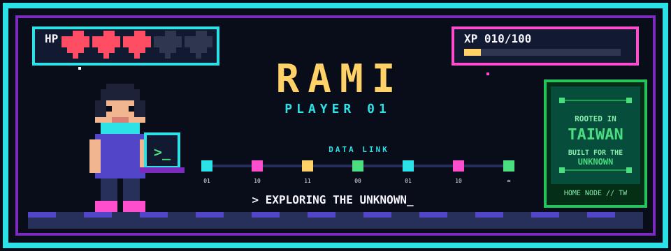
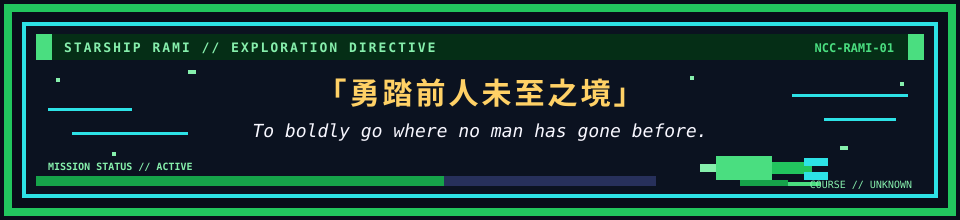

<div align="center">




</div>

<div align="center">



</div>

## `GAME MENU｜遊戲選單`

<table>
  <tr>
    <td align="center">▶<br><b>START</b><br><sub>台灣出發</sub></td>
    <td align="center">◆<br><b>QUEST</b><br><sub>持續創造</sub></td>
    <td align="center">★<br><b>SCORE</b><br><sub>000010</sub></td>
  </tr>
</table>

## `WORLD MAP｜世界地圖`

```text
[ TAIWAN ]━━◆━━[ EXPLORE ]━━◇━━[ CREATE ]━━◇━━[ BOSS ]
  HOME            NOW            LOCKED          LOCKED
```

## `INVENTORY｜道具欄`

| `SLOT 01` | `SLOT 02` | `SLOT 03` | `SLOT 04` |
|:---:|:---:|:---:|:---:|
| `???` | `???` | `???` | `???` |
| 🔒 | 🔒 | 🔒 | 🔒 |

## `ACHIEVEMENTS｜成就`

`▣ PROFILE CREATED`　`□ FIRST PROJECT`

<div align="center">

### `INSERT COIN TO CONTINUE`

`© RAMI // PLAYER 01`

</div>
